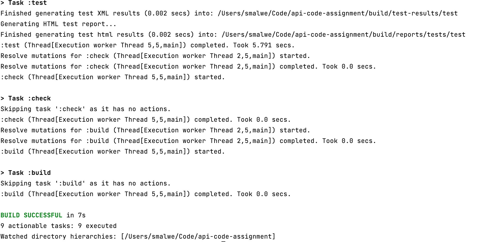
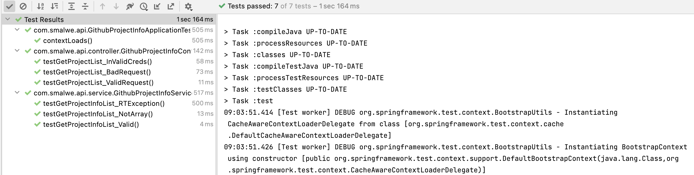
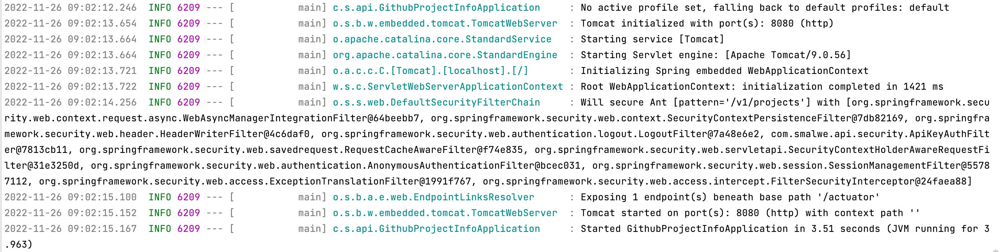
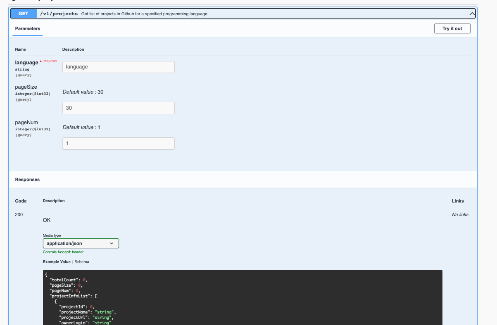
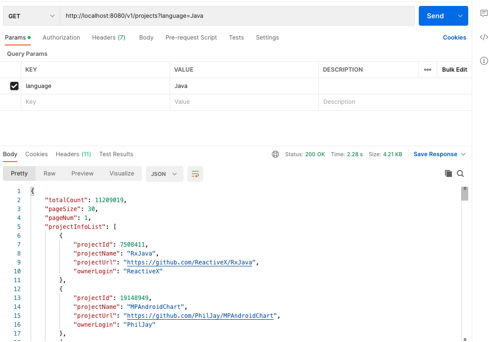

# api-code-assignment
API Code Assignment

## Component Used
- `Java` : Programming language used to code solution. Version used: 1.18
- `Gradle`: Build tool for the java application. Version used: 7.5
- `SpringBoot` : Framework used to build the REST API for Project Info API. Version used: 2.6.3

## Deliverables Summary
Build an API that allows a user:
- To fetch the project information based on the programming language provided as an input
- Project information should contain: project id, name, url and the owner login

## Assumptions
- The API is protected using API Key based authentication method
- The free version of github search repository API is used for this assignment i.e. no API key is needed to call the github API and the ratelimit is 10 calls/minute
- The API is paginated with the default pageSize=30
- If pageSize value provided > 100, it will treat it as 100
- The API always return the first page by default 
- The pageNum query parameter can be used to fetch specific page
- API Documentation is generated in Open API Specification format. Please see the `Running the solution section to access the Open API Specification`
- RESTful API Principles are followed:
- Resource name are based on Noun
- Operations on the resource  is defined via HTTP actions
- API is versioned to accommodate any upcoming changes
- Response code is as per the standards i.e.
    - 200 for successful GET
    - 400 for any invalid data
    - 404 for resource not found
    - 401 for unauthorized access
    - 500 for any application error

## Pre-requisite to run the solution
- Java18
- Gradle 7.5
- Prior to running the application on a machine make sure it has port `8080` unoccupied

## Running the solution
- I have already compiled the code and added a runnable jar in the root folder, so there is no need to compile the code again.
- Make sure you are on the root of the project
- Execute jar from commandline: `java -jar api-code-assignment-1.0-SNAPSHOT.jar`
- Postman collection can be directly loaded to run some basic test and can be found in the root folder: `API-Code-Assignment-Collection.postman_collection.json`
- Access Open API Spec UI : `http://localhost:8080/swagger-ui.html`
- Access Open API Spec JSON : `http://localhost:8080/v3/api-docs`
- Health Endpoint : `http://localhost:8080/actuator/health`

## Steps to build the jar
**Note**: I have already provided the runnable jar in the root folder, if you are interested in building the application please find the steps below
- Make sure you are on the root of the project
- Run task to get the 7.5 gradle version  : `gradle wrapper --gradle-version 7.5`
- Run : `./gradlew clean build`
- This will compile, run the test cases and build the executable jar
- Navigate to `build/libs`
- Execute jar from commandline: `java -jar api-code-assignment-1.0-SNAPSHOT.jar`
- Run application without build : `./gradlew bootRun`
- Run testcases without build : `./gradlew test`

## Areas of Improvements
Given the time limit only a set aspects of the solution is being implemented. Below are some key areas of improvement in the current implementation:
- API Rate Limiter can be added to limit the number of request per users. The requirement is generally driven by the API Pricing Models
- Based on the deployment environment, the build be can dockerized
- To ensure the code quality, the solution can be run through SonarQube
- To make sure consistent coding guidelines are followed in the organisation it can be run through checkstyle plugin
- More testcases can be added to increase the coverage
- More business logic can be added to make the solution robust.
- Caching can be implemented to make the application more performant
- Proper git branching strategy to be followed to avoid any accidental changes to the main branch
- More exhaustive API error handling scenarios can be implemented like 429 (Spike Arrest), 405 Method Not allowed etc.
- Retry mechanism can be introduced while connecting with APIs
- ZAP (a tool detected any OWASP violation) can be run to detect any security bugs in API

## Cloud Technologies
If this solution is to be designed at a production level, there are multiple options available to implement the solution. Below is just one set tools and technologies to achieve this
- `AWS API Gateway`: For exposing the API endpoints to the public
- `Route53` : To configure the domain for the APIs
- `ACM`: Generate the SSH certificates
- `AWS EKS` :  Manged Kubernetes Service acting as an container orchestration layer to deploy different microservices
- `AWS ECR` : Managed Docker Registry to store the artifacts and ensure the same artefact is promoted from lower environments till production.
- `Service Mesh (like Istio or Linkerd)`: If the organisation has multiple microservices, a service mesh is recommended approach to tackle the problems associated with back presseure, retry mechanism etc.
- `AWS VPC` : To make sure microservices are not exposed to internet and exposed only via Load balancers
- `AWS ALB` : Exposed to internet to receive any API request
- `AWS CloudWatch Logs` : For any Application and Infrastructure Monitoring
- `AWS CloudWatch Alarms` : For getting alerted on any specific API usage metrics
- `Hashicorp Vault` : For storing any DB credentials or external provider service API keys
- `AWS Elasticache` : For caching the response
- `AWS CodeBuild`: CI pipeline to compile, run, build and generate the artefacts
- `AWS CodeDeploy` : CD pipeline to deploy generated artefacts to any environment
- `AWS Autoscalar` : To scale the EKS nodes based on the traffic
- `Terraform` : To automate the deployment of the infrastructure
- `Auth0`, `Okta` : Stronger authentication mechanism like JWT based authentication along with mTLS can be used. Both OAuth0 an Okta provides such capability
### Other aspects to be considered:
- For the solution to be highly available: MultiAZ setup is recommended
- A BCDR(Business Continuity and Disaster Recovery) process to be defined by the organisation and the solution should comply to the defined process
- Solution should be compliant with the defined NFRs by the organisation
- Solution should be secure enough and should be proved by different process like PenTest, Privileged Access Management, Tamperproofing of logs etc.
- Performance and Stress testing for each component of the architecture
- VM Images should be CIS(Level 1 or 2) compliant
- Define API Versioning Strategy and key principles to be shared with the API consumers

The selection of the above tools and technologies depends on various factors like use cases, scale, context of the problem, cost, skill set availability etc.

## Implementation Summary
This flowchart  covers the key component of the code to easily understand the implementation

## Evidence of the Solution
### Application Build Evidence

### Application Test Evidence

### Application Run Evidence

### Open API Spec Evidence

### Postman Script Evidence

